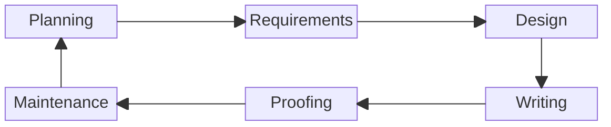

# Rebecca (Becky) Peltz

I love learning and sharing what I know with others. I mentored developers and taught adults who wanted to learn web development and programming. I learned a lot from their questions and perspectives. &#x20;

<figure><figcaption>
Becky Peltz
</figcaption></figure>

I learn by attending classes and webinars. I teach myself by reading, writing, and drawing pictures.&#x20;

###

### Contact

Email: [rebeccapeltz@gmail.com](mailto:rebeccapeltz@gmail.com)

### Social Links

[LinkedIn](https://www.linkedin.com/in/rebeccapeltz/)

[Instagram](https://www.instagram.com/rebeccapeltz/)

