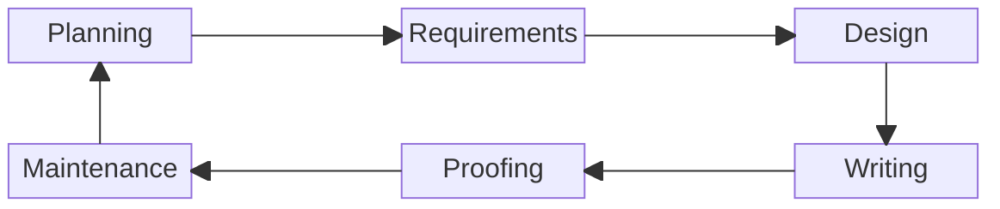

# Rebecca (Becky) Peltz

<figure><figcaption></figcaption></figure>

I love learning, and I aim for mastery. I like sharing what I know with others.  I mentored Junior developers and learned a lot from their questions and perspectives. As a software developer, I've spent many years teaching computers what to do, and along the way, I found opportunities to teach people. &#x20;

I teach myself by reading, writing, and drawing pictures.&#x20;

###

### Contact

Email: [rebeccapeltz@gmail.com](mailto:rebeccapeltz@gmail.com)

### Social Links

[LinkedIn](https://www.linkedin.com/in/rebeccapeltz/)

[Instagram](https://www.instagram.com/rebeccapeltz/)

