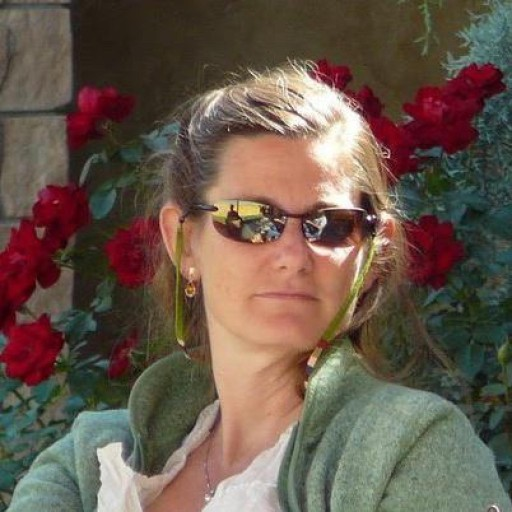
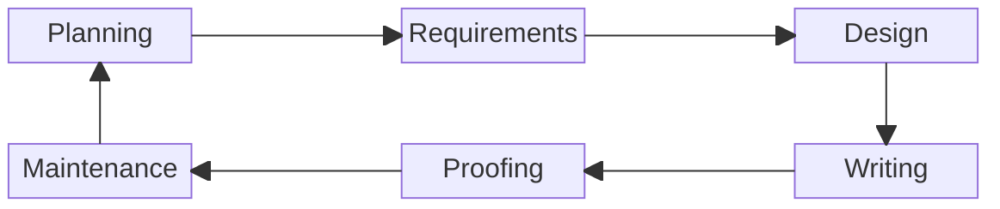

# Rebecca (Becky) Peltz

<figure><figcaption></figcaption></figure>

I love learning, and I aim for mastery. Along the way, I like sharing what I know with others.  I mentored Junior developers and learned a lot from their questions and perspectives. As a software developer, I've spent many years teaching computers what to do, and along the way, I found opportunities to teach people.  Examining a proposed system to determine how to build its components is similar to the analysis required for producing documentation and training content.

The process of creating content that shows people how to do things they've never done before is similar to the Software Development Life Cycle.  The chart below shows that the difference is that **Writing** and **Proofing** replace **Coding** and **Testing**.  For me, **Writing** includes drawing pictures and diagrams.  &#x20;

###

### Contact

Email: [rebeccapeltz@gmail.com](mailto:rebeccapeltz@gmail.com)

### Social Links

[LinkedIn](https://www.linkedin.com/in/rebeccapeltz/)

[Instagram](https://www.instagram.com/rebeccapeltz/)

[Facebook](https://www.facebook.com/becky.peltz77)

