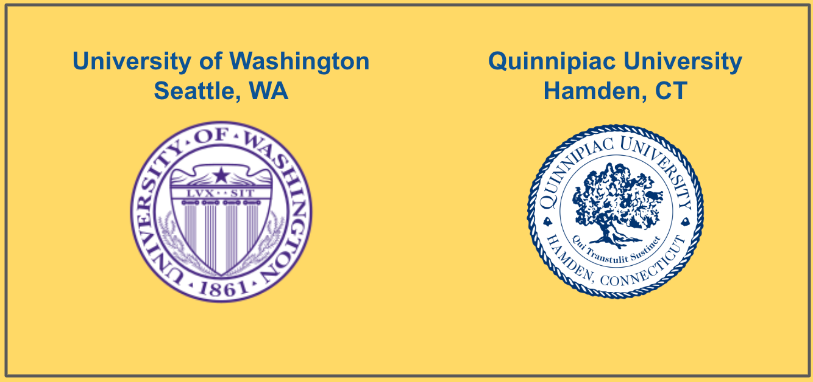

# Education, Skills, Certifications

<figure><figcaption>
UW and Quinnipiac
</figcaption></figure>

### University of Washington

Psychology, Phi Beta Kappa, Magna Cum Laude

Master Business Administration, Finance and Quantitative Methods

### Quinnipiac University

Masters Science, Curriculum Design

### Skills

* Writing and Diagramming for Documentation
* Fullstack Software Development&#x20;
* Project Management
* Course Development
* API Development and Testing
* Programming Languages: JavaScript, Node.js, Java, C#, Python
* SQL, Database Administration
* Software development with SAAS

### Certifications

* AWS Certified Cloud Practioner, 2028
* ICS2 CC Certified in Cybersecurity, 2025

