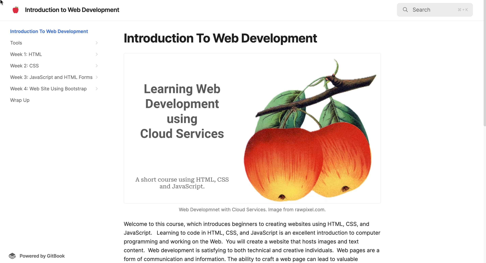

# Introduction to Web Development

<figure><figcaption>
GitBook for Introduction to Web Development Course
</figcaption></figure>

Click the link below to see the GitBook:

> [Introduction to Web Development Using Cloud Services](https://rpeltz.gitbook.io/introduction-to-web-development)

[Introduction to Web Development Using Cloud Services](https://rpeltz.gitbook.io/introduction-to-web-development)

### Description

A book that introduces the students to project-based learning with a four-week course in creating websites using HTML, CSS, and JavaScript.

### Tools/Technology

This book is written using the online [GitBook](https://www.gitbook.com/) editor and hosting. This supports a four-week course that introduces students to web development and programming.  The course teaches students how to code in HTML, JavaScript, and CSS.  It also introduces them to working in the cloud because it uses an online IDE to create the code and GitHub to store and serve the web pages that students create.
