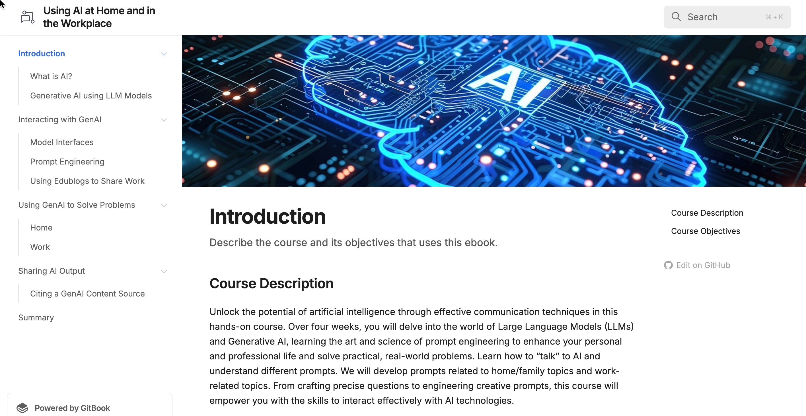

# Using AI at Home and in the Workplace

<figure><figcaption>
Artificial Intelligence
</figcaption></figure>

Click the link below to see the GitBook:



### Description

This eBook provides content for a course in prompt engineering.  Starting with an introduction to AI terminology and technology, the student is shown how to problem-solve using prompts with Generative AI.

### Tools/Technology

This book was written using the online GitBook editor and Gitbook hosting. This supports a course that introduces students to interacting with artificial intelligence online. &#x20;
