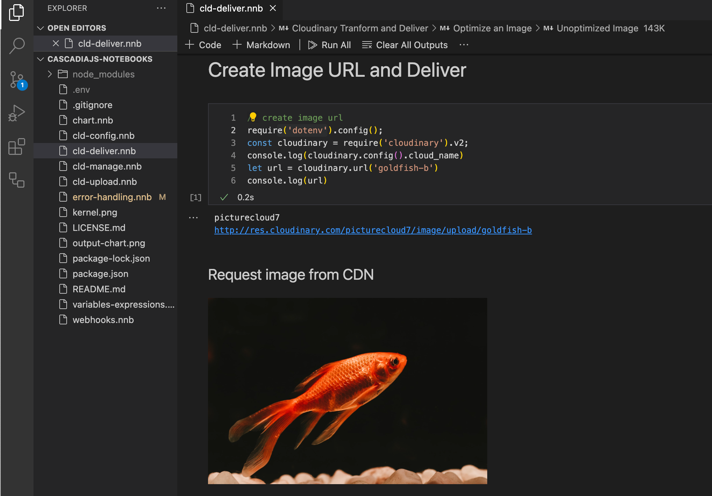

# Code Notebooks

<figure><figcaption>
Code Notebook for Cloudinary Image Delivery API
</figcaption></figure>

### Description

I attended and [gave a talk](https://2022.cascadiajs.com/speakers/rebecca-peltz) at the [Cascadia JS Conference in 2022](https://2022.cascadiajs.com/conference). I shared Visual Studio's Code Notebook extensions, which allow you to create Jupyter-like notebooks in different languages. Notebooks can be shared, and API keys can be added as hidden values in the VS Code installation.  These notebooks create a playground for learning and sharing code.

### Technology

I used the Visual Studio Code [Node.js Notebooks (repl)](https://marketplace.visualstudio.com/items?itemName=donjayamanne.typescript-notebook) extension to create sample code demonstrating the use of APIs and handling errors in JavaScript. &#x20;

[Node Notebooks Code](https://github.com/rebeccapeltz/cascadiajs-notebooks)
