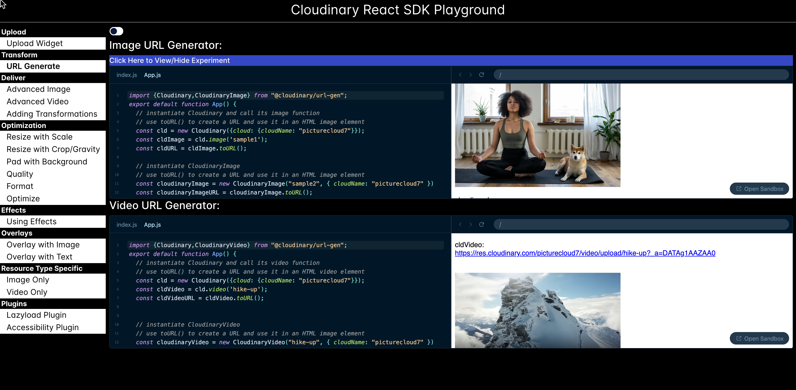

# Code Sandbox Playground for  Cloudinary Transformations Prototype

<figure><figcaption>
Prototype for an application to experiment with Cloudinary React SDK
</figcaption></figure>

### Description

While working at Cloudinary as a Curriculum Program Manager, I created a prototype for a playground using a React library called [sandpack-react](https://www.npmjs.com/package/@codesandbox/sandpack-react).  This library is hosted by [codesandbox.io](https://codesandbox.io/).  The intention was to provide sample code that the user could modify and try out the creation of  Cloudinary transformations on images, video, and audio.

### Technology

This front-end application was created with the React framework using the Cloudinary React SDK.

[Code](https://github.com/rebeccapeltz/sandbox-react-cld)

[Application](https://beckypeltz.online/sandbox-react-cld/)
