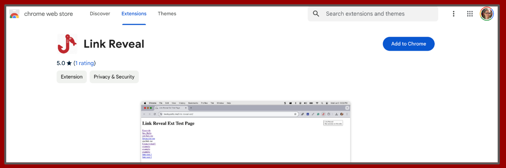

# Design, Create, and Publish a Chrome Extension Guide

<figure><figcaption>
Link Reveal Extenstion Published in Chrome Web Store
</figcaption></figure>

Click the link below to see the online guide:

[Create and Publish a Chrome Browser Extension](https://rpeltz.gitbook.io/create-and-publish-a-chrome-browser-extension/)

### Description

This learning guide uses an example of a Chrome Extension that I created while studying Cybersecurity.  There are so many phishing attacks carried out these days.  So much is left to the user to exercise restraint when clicking a link.  The instruction is usually given that to help avoid phishing, hover over links and see if they are suspect before clicking on them.  As an application developer, I felt that creating a browser extension might help to reveal what's programmed in a link.  My extension generates a popup window with a report describing all the attributes in the user's web page links.  It also shows red and green indicators for all possible problems a link might have based on the attributes in the element.

I used Chrome to create the extension. When I discovered that Chrome had created a new extension version and that the manifest and code requirements had changed, I used this opportunity to make a guide to help me remember how I designed, coded and published the extension.

I shared a link to this guide in a [blog post about phishing](https://dev.to/rebeccapeltz/stop-phishing-by-analyzing-the-bait-3f0f).

### Technology

This guide was created using [GitBook](https://www.gitbook.com/).  The Chrome Extension was coded using HTML, JavaScript, and CSS.

