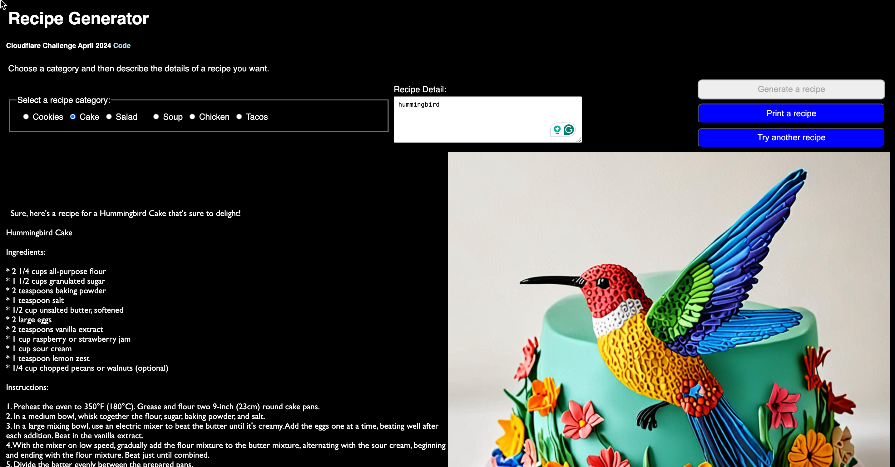

# Dev.to Cloudflare AI Challenge: Recipe Generator

<figure><figcaption>
Cloudflare Generative AI Dev.to Hackathon
</figcaption></figure>

Click on links to run application and view code:


[Untitled](https://app.gitbook.com/o/zlYLwSsGRoLhpALpi1vE/blocks/syb\_xVVqz)



[Untitled](https://app.gitbook.com/o/zlYLwSsGRoLhpALpi1vE/blocks/syb\_5GdvQ)


### Description

[Dev.to](https://dev.to/) is a website where developers use blogs to share ideas and code.  Dev.to sponsors hackathons with its partners.

I created a web application that shares text and pictures for recipes. I used Cloudflare models to generate streaming text for the recipe and an image generator to visualize what the recipe might produce.

### Tools/Technology

This application was created for a [dev.to challenge](https://dev.to/challenges/cloudflare). It uses two Cloudflare models that were available at the time:&#x20;

* Chat: @hf/thebloke/llama-2-13b-chat-awq
* Image Generator: @cf/bytedance/stable-diffusion-xl-lightning
