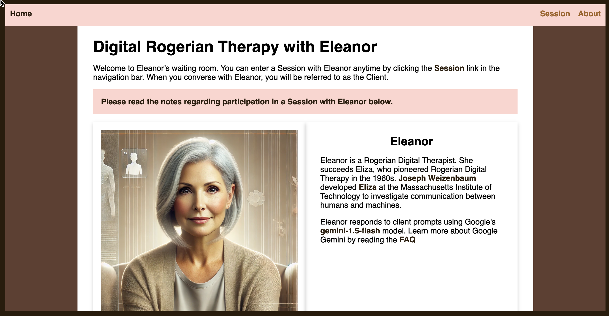

# Eleanor: An AI Application

<figure><figcaption>
Eleanor Home Page
</figcaption></figure>

[Eleanor Application](https://eleanor2024.netlify.app/)

[Code](https://github.com/rebeccapeltz/eleanor)

### Description

Eleanor was created for a Devpost hackathon sponsored by Google.  The full gallery of entries can be found on the [Devpost website](https://womentechmakers.devpost.com/project-gallery).  The challenge was for women in technology to build websites using Google AI that would be of use or interest to women.  I created a modern-day [ELIZA](https://en.wikipedia.org/wiki/ELIZA) that uses Google AI to carry on a conversation.  See this [page](https://eleanor2024.netlify.app/about) for more information.

### Tools/Technology

This full-stack application uses React on the front end and Netlify server functions on the back end.   The server functions send prompts to Google AI and return responses to the front end. The application is hosted on Netlify.  The image of Eleanor is from ChatGPT.

