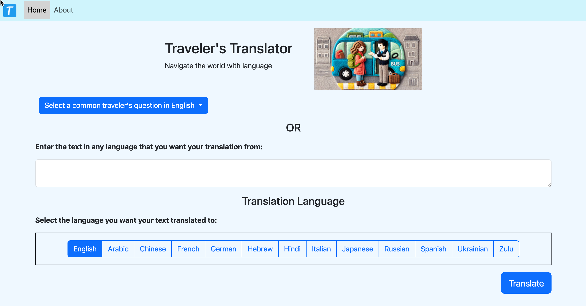
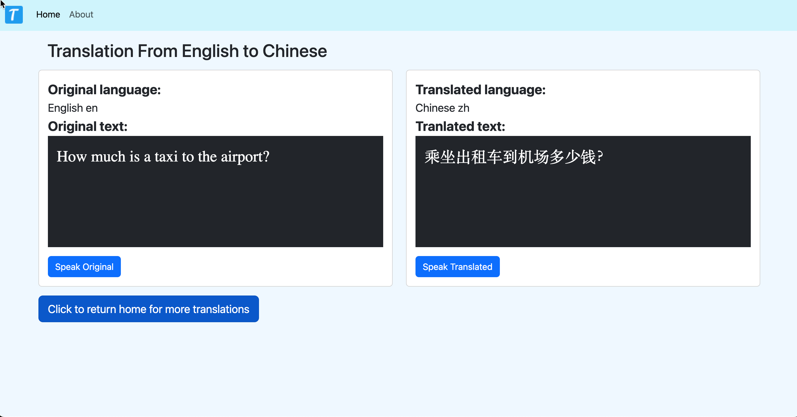

# Traveler's Translator: Translation and Speech AI

<figure><figcaption>
Home: Enter text and choose language to translate to
</figcaption></figure> <figure><figcaption>
Result: View orignal and translated text. Click on speech button to hear the text spoken
</figcaption></figure>

Note: this was developed using a free tier in Azure Application that is no longer accessible.

[Code](https://github.com/rebeccapeltz/FlaskTranslation)

### Azure Services and Microsoft AI Copilot Extension

The hackathon was sponsored by Microsoft and hosted by DevPost.  The goal was to use Azure AI services and Copilot in Visual Studio code. This application was created using Azure Services:

AI Speech Service

AI Translator Speech Service

Web Application Service

Copilot in Visual Studio Code

### Software Stack

The web application uses the Python Flask framework to render HTML templates and access Microsoft APIs via routes that interface with Azure APIs.  Templates are created using HTML/CSS/JS.

#### Speech Translation

The Azure Speech Translator service API is called from the web server `/index` route using a direct API call to the Azure API. The Flask API accepts user-input text as the original text and a user-supplied language code for the language used for the translated text. The speech translator service uses the language code to generate text in the target language.  The service detects the language of the input text and translates the text into the language specified by the selected language code.

#### Speech Synthesis

The web server has a `/synthesis`  route that calls the Azure Speech service and uses the Microsoft Speech service Python SDK.  The input to the application route is

* text from the user
* language code for the text
* a voice that has been preselected for each language code

The application server's `generate_speech` function uses the Speech SDK to create an audio stream in Azure based on the text, the language, and the voice. The web server receives the audio data stream from the speech service in WAV format.  The audio data doesn't have a WAV header, so the web server adds that before sending the data back to the browser as a blob.  JavaScript on the web picks up the blob from the server and plays the audio.

