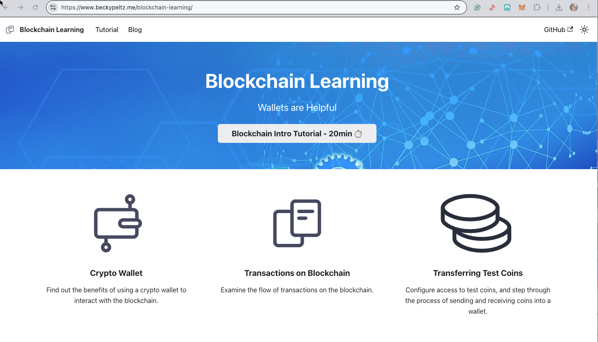

# Blockchain Learning

<figure><figcaption>
Tutorial to learn how to interact with the blockchain using a wallet
</figcaption></figure>

Click the link below to see the docusaurus book:


[Untitled](https://app.gitbook.com/o/zlYLwSsGRoLhpALpi1vE/blocks/syb\_NgNys)


### Description

This eBook provides content for a course using the Meta Mask wallet to move currency on the blockchain.  The course content also provides an introduction to the blockchain.

### Tools/Technology

This book was created using Docusaurus, a book that explains blockchains' origin and basic principles. It also includes an exercise using a blockchain wallet to retrieve and store test cryptocurrency.

My goal was to keep the content short and to the point so that the reader could quickly grasp some of blockchain technology's basic functionality and features. &#x20;

Docusaurus renders a web book similar to Gitbook. This book is deployed to GitHub.
