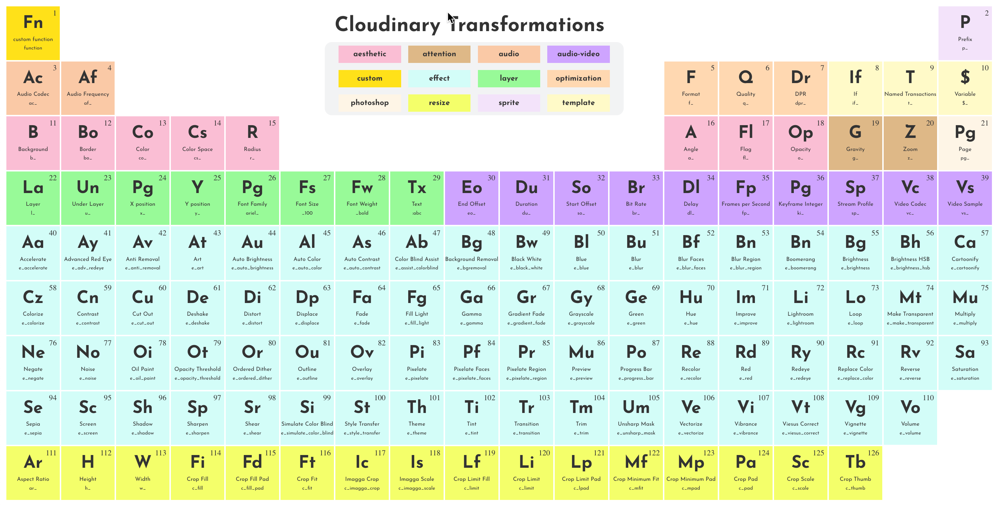

# Periodic Table of Cloudinary Transformations

<figure><figcaption>
Periodic Table of Cloudinary Transformations
</figcaption></figure>

### Description

Cloudinary transformations are used to transform media.  They can be applied to images, video, and audio. Some transformations can apply to all media types, and some are specific to the media.  Many transformations are available and documented, but it can be challenging to remember them all and to understand them as collections with similar intentions.  Many transformations apply an "effect," which is easily seen in the period table.  They are the pale blue-green making up the center of the table. The period table was created to organize chemicals by atomic structure and weight, representing a natural ordering.  The goal of this periodic table is to suggest a natural ordering.  Creating order and structure precedes creating knowledge.

The application itself, is clickable and clicking on a "element" within it should take you to the documenation for it.

### Tools/Technology

This application was created using the React framework.

[code](https://github.com/rebeccapeltz/cld-periodic-table)

[application](https://www.beckypeltz.me/cld-periodic-table/)

