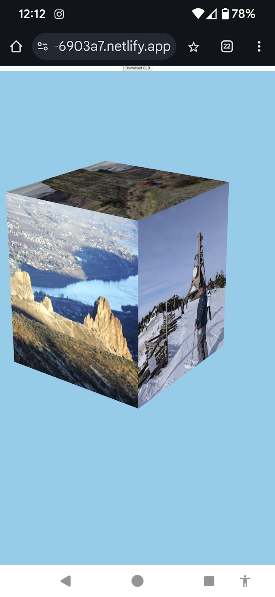

# Prototype for Hackathon 3D Project

<figure><figcaption>
 3D Photocube on cell phone
</figcaption></figure>

Open the link below on your cell phone to spin the photo cube with your fingers.  The code used to create the photo cue is also shown below.





### Description

This prototype was created as part of a team project for a hackathon sponsored by my employer for employees only.

### Tools/Technology

I used the NPM [three](https://www.npmjs.com/package/three) package to create a 3D photocube.

