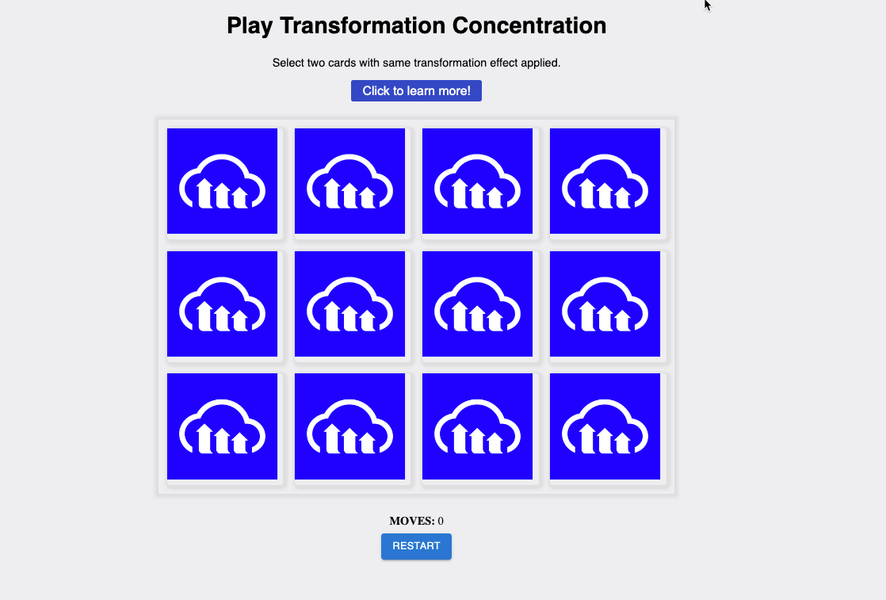
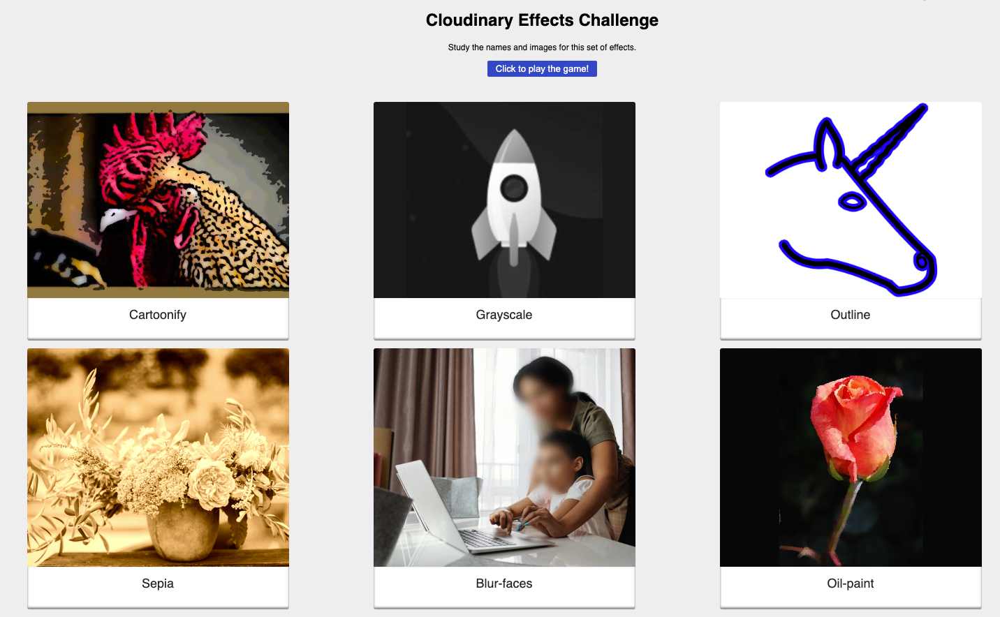

# Transformation Concentration

<figure><figcaption>
Gamifying Learning by using the Concentration game format to learn common transformations
</figcaption></figure>

### Description

Cloudinary is a SAAS product that makes it easy to transform images. To create a transformation, the user uploads a file to Cloudinary. Then, the image may be transformed by injecting instructions into the path of the URL to the uploaded image. &#x20;

Transformations may deal with sizing and optimization or apply special effects.  In this game, the player learns to recognize and name special effects.

First, a training page is displayed, and then the user sees the image above. The names and sample images are randomly loaded behind the Cloudinary logo. The user must click on two logo images to see if they match. If there's a match, the name and image remain visible; otherwise, they are hidden.

#### Training Page

The training page is shown below.  To win the game, players must be able to match an image to the word describing it.  For example, on the upper left, a chicken photo is cartoonified. The player must learn to associate the image of the cartoonified chicken with the word Cartoonify.

<figure><figcaption>
Training Page
</figcaption></figure>

Tools and Technology

This game was built using React.&#x20;

[code](https://github.com/rebeccapeltz/transformation-concentration)

[demo](https://transformation-concentration.netlify.app/)
